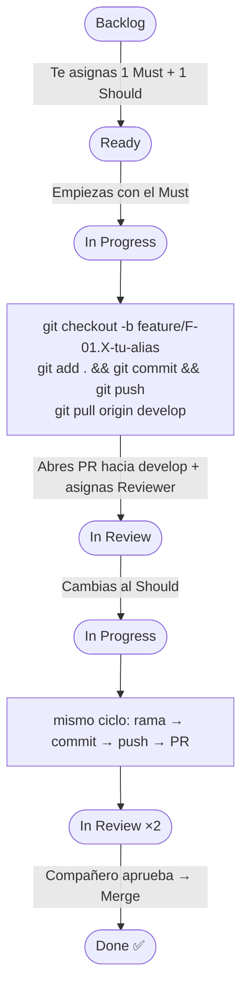

# 📖 Onboarding Repo: Team Building & Git Flow Practice

Este repositorio es el entorno de prácticas oficial para la asimilación del flujo de trabajo con Git, revisión de código por pares (Peer Review) y familiarización con la estructura de documentación estática (Vitepress).

El objetivo es modificar colaborativamente una web estática de presentación del equipo mediante la resolución de **12 Issues predefinidos**, enfrentándose a la sincronización de ramas y resolución de conflictos.

## 📂 Estructura del Repositorio

```text
├── docs/
│   ├── .vitepress/        # Configuración del generador de sitios estáticos
│   └── src/               # Raíz de contenido Vitepress (srcDir)
│       ├── index.md       # Landing page del equipo (A modificar)
│       ├── team.md        # Perfiles y hobbies de los miembros (A modificar)
│       ├── contact.md     # Directorio de contacto institucional (A modificar)
│       └── backlog/       # Definición de los 12 issues
│           ├── F-01.1.md
│           ├── ...
│           └── F-01.12.md
└── README.md              # Este archivo
```

## 🎯 Dinámica de los Issues

Existen **12 Issues** registrados en el tablero del proyecto, divididos por prioridad MoSCoW:

* **6 Prioridad `Must`:** Requisitos obligatorios (datos de presentación básicos, contacto, stack…).
* **6 Prioridad `Should`:** Requisitos recomendados (hobbies, recomendaciones, objetivos…).

Cada desarrollador asumirá **2 issues** (1 Must + 1 Should). La definición completa de cada issue, con el bloque de código a insertar y los Criterios de Aceptación, está en `docs/src/backlog/`.

## 🗂️ Fase 0 — Tablero Kanban: Demo Kanban

Antes de tocar ningún archivo, hay que gestionar el trabajo desde el tablero del proyecto en GitHub.

El tablero se llama **"Demo Kanban"** y tiene las siguientes columnas:

| Columna | Significado |
| --------- | ------------- |
| **Backlog** | Issues disponibles, aún sin asignar |
| **Ready** | Issues asignados y listos para empezar |
| **In Progress** | Issue en el que estás trabajando ahora mismo |
| **In Review** | PR abierto, esperando revisión de un compañero |
| **Done** | PR aprobado y mergeado a `develop` |

### Cómo acceder al tablero

1. Ve a la página principal del repositorio en GitHub.
2. Haz clic en la pestaña **"Projects"** (barra superior del repo).
3. Selecciona el proyecto **"Demo Kanban"**.

### Asignarte tus dos issues

Desde el tablero **Backlog**:

1. Localiza un issue de prioridad **Must** (etiqueta verde `Must`) que nadie haya reclamado aún.
2. Haz clic sobre él para abrir el panel lateral.
3. En la sección **"Assignees"** (lado derecho), haz clic y selecciónate a ti mismo.
4. Cambia el estado del issue en el tablero arrastrándolo a la columna **Ready**, o usando el desplegable de estado en el panel lateral.
5. Repite los pasos 1–4 con un issue de prioridad **Should**.

> ⚠️ **No te asignes más de 1 Must y 1 Should.** El tablero es visible para todo el equipo.

## ⚙️ Flujo de Trabajo por Issue

Ejecuta este ciclo **una vez por cada issue asignado**. Empieza siempre por el **Must**.

---

### 🔵 PASO 1 — Mover el issue a "In Progress"

Antes de escribir una sola línea de código:

1. Abre el tablero **Demo Kanban**.
2. Arrastra el issue con el que vas a empezar desde **Ready** a **In Progress**.

> Solo debe haber **un issue en In Progress** a la vez por persona.

---

### 🔵 PASO 2 — Preparar el entorno local

Asegúrate de partir siempre de la rama de integración (`develop`) actualizada:

```bash
git checkout develop
git pull origin develop
```

Crea tu rama siguiendo la convención de nombres:

```bash
git checkout -b feature/F-01.X-<tu-alias>
# Ejemplo: git checkout -b feature/F-01.1-guillermo-garrido
```

---

### 🔵 PASO 3 — Desarrollo

1. Abre el archivo del issue correspondiente en `docs/src/backlog/F-01.X.md` y lee los **Criterios de Aceptación**.
2. Copia el bloque Markdown preparado en el issue y pégalo en el archivo indicado (`team.md`, `contact.md` o `index.md`).
3. Sustituye **todos** los valores entre `< >` por tu información real.
4. Añade al final de tu bloque la sección obligatoria:

```md
## UserManual
<Explica brevemente qué bloque añadiste y cómo otro miembro podría replicarlo>
```

---

### 🔵 PASO 4 — Commit y subida de la rama

Una vez guardados los cambios:

```bash
git add .
git commit -m "feat(team): añadir <descripción breve> de <TuNombre> (Closes #X)"
# Ejemplo: git commit -m "feat(team): añadir tarjeta básica de Guillermo Garrido (Closes #1)"

git push -u origin feature/F-01.X-<tu-alias>
```

> La referencia `Closes #X` vincula automáticamente el commit con el issue en GitHub.

---

### 🔵 PASO 5 — Sincronización con `develop` (evitar conflictos)

Dado que varios compañeros están modificando los **mismos archivos** a la vez, antes de abrir el PR debes incorporar los últimos cambios integrados:

```bash
# Actualiza tu información de las ramas remotas
git fetch origin

# Trae los cambios de develop a tu rama actual
git pull origin develop
```

**Si Git detecta un conflicto de merge**, verás algo como esto en el archivo afectado:

```text
<<<<<<< HEAD
Tu contenido
=======
Contenido de tu compañero
>>>>>>> origin/develop
```

Para resolverlo:

1. Abre el archivo en tu editor.
2. Decide qué contenido se queda (normalmente **ambos bloques**, uno después del otro).
3. Elimina las líneas `<<<<<<<`, `=======` y `>>>>>>>`.
4. Guarda el archivo.
5. Registra la resolución y completa el merge:

```bash
git add .
git commit -m "merge: resolver conflicto en team.md con develop"
```

---

### 🔵 PASO 6 — Abrir el Pull Request (PR)

Con tu rama ya sincronizada, súbela y abre el PR:

```bash
git push origin feature/F-01.X-<tu-alias>
```

Ahora, en GitHub:

1. Ve a la pestaña **"Pull requests"** del repositorio.
2. Haz clic en **"New pull request"** (o en el botón amarillo que aparece automáticamente).
3. Configura el PR:
   * **base:** `develop` ← **compare:** `feature/F-01.X-<tu-alias>`
4. Ponle un título descriptivo: `feat(team): añadir tarjeta básica de Guillermo Garrido`
5. En la descripción escribe `Closes #X` (número del issue).
6. En la sección **"Reviewers"** (panel derecho), asigna al **compañero de la derecha de tu equipo**.
7. Haz clic en **"Create pull request"**.

Por último, mueve el issue en el tablero **Demo Kanban** a la columna **In Review**.

---

### 🔵 PASO 7 — Segundo issue

Ahora repite el proceso completo (pasos 1–6) con tu issue de prioridad **Should**.

> Mueve el issue Should a **In Progress** en el tablero antes de empezar. Recuerda que el Must debe estar ya en **In Review**.

## 👀 Revisión por Pares (Peer Review)

Cuando un compañero te asigne como Reviewer en su PR, recibirás una notificación en GitHub. Sigue estos pasos:

### Cómo revisar un PR

1. Ve a la pestaña **"Pull requests"** del repositorio.
2. Abre el PR que te han asignado.
3. Haz clic en la pestaña **"Files changed"** para ver exactamente qué líneas se han modificado.
4. Descarga la rama del compañero para comprobarla en local (opcional pero recomendado):

    ```bash
    git fetch origin
    git checkout feature/F-01.X-<alias-compañero>
    ```

5. Revisa el contenido bloque a bloque según los **Criterios de Aceptación** del issue correspondiente (en `docs/src/backlog/F-01.X.md`).

### Si todo es correcto ✅

1. En el PR, haz clic en **"Review changes"** (botón verde arriba a la derecha de "Files changed").
2. Selecciona **"Approve"** y escribe un comentario breve de confirmación.
3. Haz clic en **"Submit review"**.
4. Haz clic en **"Merge pull request"** → **"Confirm merge"** para integrar los cambios en `develop`.
5. Mueve el issue en el tablero **Demo Kanban** a la columna **Done**.

### Si hay errores o falta algo ❌

1. En el PR, haz clic en **"Review changes"**.
2. Selecciona **"Request changes"**.
3. En el comentario, indica **qué criterio de aceptación no se cumple** y porque.
4. Haz clic en **"Submit review"**.
5. El autor del PR recibirá la notificación, corregirá en su rama local, hará un nuevo commit y subirá los cambios. El PR se actualizará automáticamente.
6. Repite la revisión hasta aprobar.

> **No hagas merge si algún criterio no está cumplido.** La revisión por pares es parte de la evaluación.

## 📋 Resumen Visual del Flujo Completo


